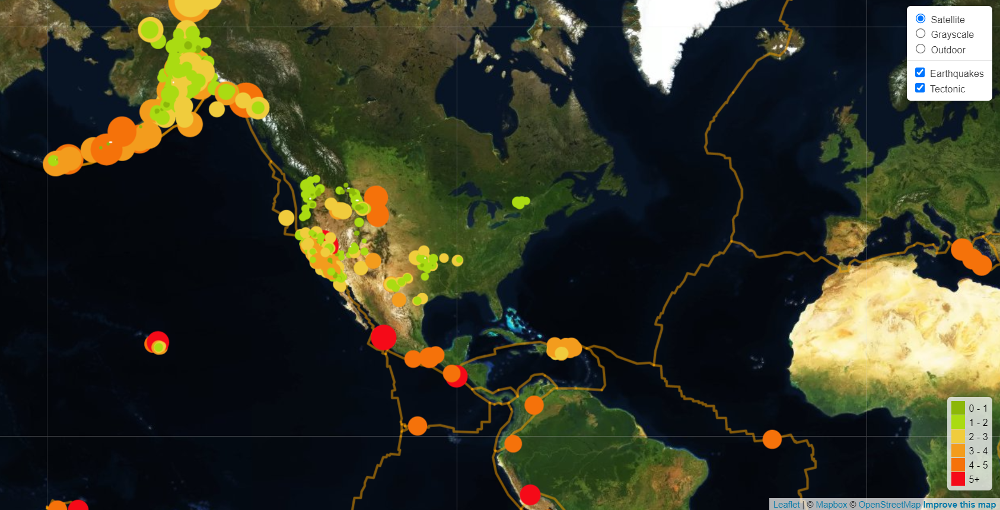

# leaflet-challenge
## Background
We are tasked to create earthquake plot based on USGS data. The plots shall include the location of the earthquake which is marked by a circle. Circle radius shows the magnitude of the earthquake. Larger the circle stronger the earthquake. Additionally, the following also added:
- pop-up of earthquake data also been shown when the earthquake circle is clicked. 
- plot legend, color coded magnitude of earthquake 

## Solutions


## Project structure
```
|__ Leaflet-Step1
|__ Leaflet-Step2
|__ earthquakes.png
|__ README.md
```